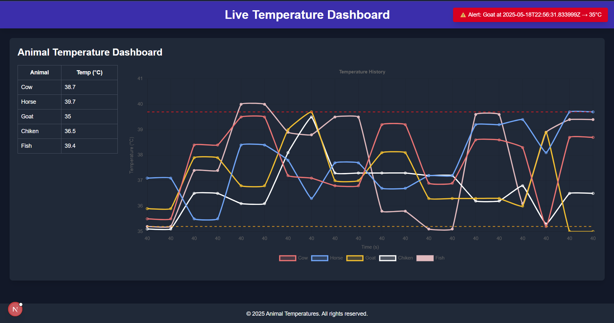
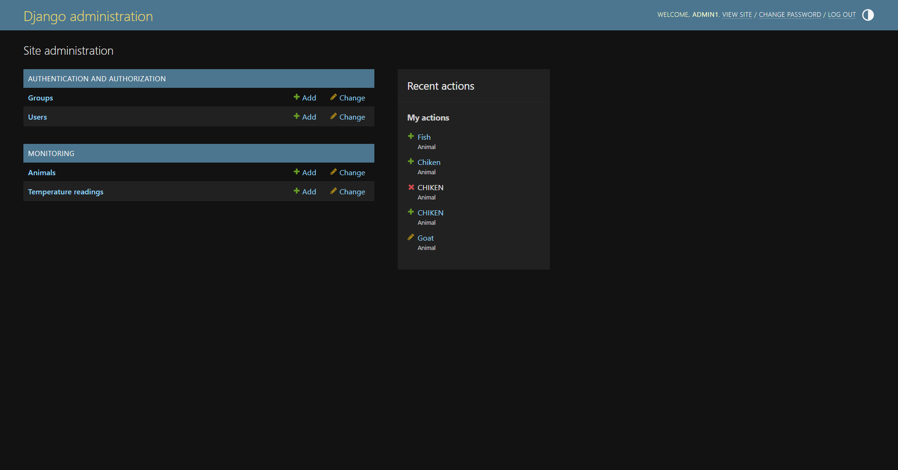

# Real-Time Temperature Monitoring for Animals  
**OS Project — Real-Time Animal Health Monitoring System**

---

## Admin Panel Access

To manage animals via the admin interface:

- **Login:** `admin1`  
- **Password:** `1`

---


### Backend Setup (Django)

**In the first terminal:**

```bash
.\venv\Scripts\Activate
cd django-backend
python manage.py runserver
```

---

### Frontend Setup (Next.js)

**In the second terminal:**

```bash
cd real-time-temperature-monitoring-for-animals
npm run dev
```

---

## Access the App

Open your browser and go to:

 [http://localhost:3000](http://localhost:3000)

---

## Notes

- Make sure your backend is running before starting the frontend.
- Alerts will display automatically when animal temperatures go outside the safe range.
- Real-time chart updates occur every 2 seconds.

---

## 🖼️ Demo Previews

Here’s how the app looks in action:

<div align="center">
  
  <p><i>📈 Live Temperature Chart with Multiple Animals</i></p>
</div>

<br/>

<div align="center">
  
  <p><i>Admin profile</i></p>
</div>
